# 📱 Praktikum Flutter - hello_world

## 👤 Identitas Mahasiswa
- **Nama:** Muhammad Riswan  
- **NPM:** 2340304016  

---

# Praktikum 1 - Membuat Project Flutter Baru

## 📌 Langkah 1: Membuka Command Palette


### Penjelasan:
Pada langkah ini saya membuka Command Palette dengan menekan Ctrl + Shift + P, kemudian mengetik Flutter dan memilih "Flutter: New Application Project".

---

## 📌 Langkah 2: Memilih Folder


### Penjelasan:
Saya memilih folder penyimpanan project Flutter pada direktori yang mudah diakses.

---

## 📌 Langkah 3: Memberi Nama Project


### Penjelasan:
Saya memberi nama project "hello_world" dengan format huruf kecil tanpa spasi.

---

## 📌 Langkah 4: Project Berhasil Dibuat


### Penjelasan:
Project berhasil dibuat dengan munculnya pesan "Your Flutter Project is ready!" dan struktur project tampil di VS Code.

---

# Praktikum 2 - Menghubungkan Perangkat Android atau Emulator

## 📌 Deskripsi
Pada praktikum ini dilakukan proses menghubungkan perangkat Android atau emulator ke Android Studio agar aplikasi Flutter dapat dijalankan.

---

## 🎥 Langkah 1: Menonton Video Tutorial (Opsional)


### Penjelasan:
Pada langkah ini saya menonton video tutorial sebagai referensi dalam memahami proses praktikum. Langkah ini bersifat opsional.

---

## 🔧 Langkah 2: Mengaktifkan USB Debugging

### 📍 a. Mengaktifkan Developer Options


### Penjelasan:
Masuk ke Settings > About Phone, lalu menekan Build Number sebanyak 7 kali hingga muncul notifikasi bahwa mode developer telah aktif.

---

### 📍 b. Mengaktifkan USB Debugging


### Penjelasan:
Masuk ke Settings > Developer Options, lalu mengaktifkan USB Debugging agar perangkat dapat terhubung dengan Android Studio.

---

### 📍 c. Install Google USB Driver (Windows)


### Penjelasan:
Melalui Android Studio membuka SDK Manager, lalu menginstal Google USB Driver agar perangkat dapat dikenali oleh komputer.

---

## 🔌 Langkah 3: Menjalankan Aplikasi via Kabel USB


### Penjelasan:
Perangkat dihubungkan menggunakan kabel USB, kemudian dipilih pada Android Studio dan aplikasi dijalankan hingga tampil di perangkat.

---

## 📶 Langkah 4: Menghubungkan via Wi-Fi


### Penjelasan:
Perangkat dihubungkan menggunakan jaringan Wi-Fi dengan fitur Wireless Debugging, kemudian dipasangkan melalui QR Code atau pairing code.

---
## 📱 Hasil Running di Device


### Penjelasan:
Aplikasi berhasil dijalankan pada perangkat Android saya menggunakan koneksi USB Debugging. Hal ini menunjukkan bahwa perangkat telah berhasil terhubung dengan Flutter.

---

## ⚠️ Pemecahan Masalah

### Penjelasan:
Jika terjadi kendala seperti perangkat tidak terdeteksi, dilakukan beberapa solusi seperti:
- Mencabut dan memasang ulang kabel USB
- Restart Android Studio
- Mengaktifkan ulang USB Debugging
- Revoke USB debugging authorization

---

# Praktikum 3 - Membuat Repository GitHub dan Laporan Praktikum

## 📌 Deskripsi
Pada praktikum ini dilakukan proses pembuatan repository GitHub, menghubungkan project Flutter ke Git, serta melakukan commit dan push ke repository.

---

## 🌐 Langkah 1: Membuat Repository GitHub


### Penjelasan:
Saya membuat repository baru di GitHub dengan nama "flutter-fundamental-part1".

---

## 📁 Langkah 2: Repository Berhasil Dibuat


### Penjelasan:
Repository berhasil dibuat dan menampilkan halaman utama repository.

---

## 💻 Langkah 3: Inisialisasi Git


### Penjelasan:
Saya membuka terminal di VS Code dan menjalankan perintah:
```bash git init```

---

## 📤 Langkah 4: Stage File .gitignore


### Penjelasan:
Saya melakukan stage pada file `.gitignore` melalui menu Source Control di VS Code untuk menyiapkan file sebelum di-commit.

---

## 📝 Langkah 5: Commit Pertama


### Penjelasan:
Saya melakukan commit pertama dengan pesan:
```bash tambah gitignore```

---

## 🚀 Langkah 6: Push ke Repository


### Penjelasan:
Saya melakukan push ke repository GitHub melalui menu di VS Code agar perubahan tersimpan secara online.

---

## 🔗 Langkah 7-8: Menambahkan Remote Repository


   

### Penjelasan:
Saya menambahkan remote repository dengan memilih "Add Remote", kemudian memasukkan URL repository GitHub dan memberi nama remote sebagai: ``origin``

---

## 📄 Langkah 9: Push File README.md


### Penjelasan:
Saya melakukan commit dan push file README.md ke repository GitHub. Saat proses push, saya menggunakan personal access token sebagai pengganti password.

---

## 📦 Langkah 10: Push Semua File Project


### Penjelasan:
Saya melakukan stage all changes, kemudian commit dengan pesan: ``project hello_world`` lalu melakukan push ke repository.

---

## ▶️ Langkah 11: Menjalankan Project Flutter


### Penjelasan:
Saya menjalankan project Flutter menggunakan emulator atau perangkat fisik hingga aplikasi berhasil ditampilkan.

---

## 📸 Langkah 12: Screenshot Hasil Running


### Penjelasan:
Saya menampilkan hasil running aplikasi Flutter dengan teks yang telah diubah menjadi nama lengkap sebagai bukti bahwa aplikasi berhasil dijalankan.

---

# Praktikum 4 - Menerapkan Widget Dasar

## 📌 Deskripsi
Pada praktikum ini dilakukan pembuatan widget dasar pada Flutter yaitu Text Widget dan Image Widget, serta menghubungkannya ke file main.dart.

---

## 📝 Langkah 1: Text Widget


### Penjelasan:
Saya membuat folder `basic_widgets` di dalam folder lib, kemudian membuat file `text_widget.dart`. Pada file tersebut saya menambahkan kode untuk menampilkan teks menggunakan widget Text dan mengganti nama "Fulan" dengan nama lengkap saya.

---

## 🔗 Integrasi ke main.dart


### Penjelasan:
Saya melakukan import file text_widget.dart ke dalam file main.dart, kemudian mengganti widget Text default dengan widget MyTextWidget sehingga teks dapat ditampilkan pada aplikasi.

---

## 🖼️ Hasil Text Widget


### Penjelasan:
Aplikasi berhasil menampilkan teks sesuai dengan yang telah dibuat pada Text Widget.

---

## 🖼️ Langkah 2: Image Widget


### Penjelasan:
Saya membuat file image_widget.dart di dalam folder basic_widgets, kemudian menambahkan kode untuk menampilkan gambar menggunakan widget Image.

---

## ⚙️ Konfigurasi Asset (pubspec.yaml)


### Penjelasan:
Saya menambahkan asset gambar pada file pubspec.yaml agar gambar dapat digunakan di dalam project.

---

## 🖼️ Hasil Image Widget


### Penjelasan:
Aplikasi berhasil menampilkan gambar yang telah ditambahkan ke dalam folder assets.

---

# Praktikum 5 - Menerapkan Widget Material Design dan iOS Cupertino

## 📌 Deskripsi
Pada praktikum ini saya mempelajari berbagai widget pada Flutter, baik dari Material Design maupun iOS Cupertino, serta mengimplementasikannya ke dalam project.

---

## 🍎 Langkah 1: Cupertino Button dan Loading Bar


### Penjelasan:
Saya membuat file `loading_cupertino.dart` di dalam folder `basic_widgets`, kemudian menambahkan widget CupertinoButton dan CupertinoActivityIndicator untuk menampilkan tombol dan loading khas iOS.

---

## 🖼️ Hasil Cupertino Widget


---


## 🔘 Langkah 2: Floating Action Button (FAB)


### Penjelasan:
Saya membuat file fab_widget.dart dan menambahkan widget FloatingActionButton yang berfungsi sebagai tombol aksi dengan ikon.

---

## 🖼️ Hasil FAB


---

## 🧱 Langkah 3: Scaffold Widget


### Penjelasan:
Saya mengubah file main.dart dengan menggunakan Scaffold untuk mengatur layout aplikasi seperti AppBar, body, dan FloatingActionButton.

---

## 🖼️ Hasil Scaffold


---

## 💬 Langkah 4: Dialog Widget


### Penjelasan:
Saya menambahkan AlertDialog yang akan muncul ketika tombol ditekan, sebagai bentuk interaksi dengan pengguna.

---

## 🖼️ Hasil Dialog 


---

## ⌨️ Langkah 5: Input dan Selection Widget


### Penjelasan:
Saya menggunakan TextField untuk menerima input dari pengguna berupa teks.

--- 

## 🖼️ Hasil Input


---

## 📅 Langkah 6: Date and Time Picker


### Penjelasan:
Saya menambahkan fitur Date Picker untuk memilih tanggal, yang akan ditampilkan pada aplikasi.

---

## 🖼️ Hasil Date Picker


---

## 1. Introduction

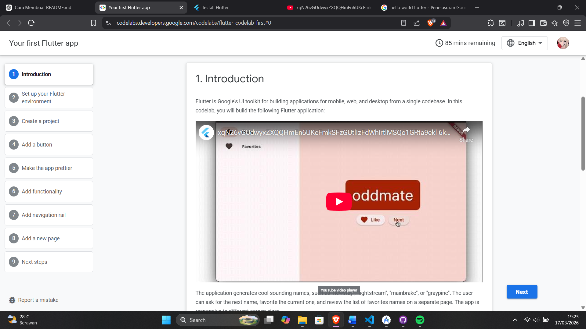

### Penjelasan:
Pada tahap ini dijelaskan tujuan dari pembuatan aplikasi Flutter serta fitur yang akan dipelajari.

---

## 2. Setup Environment

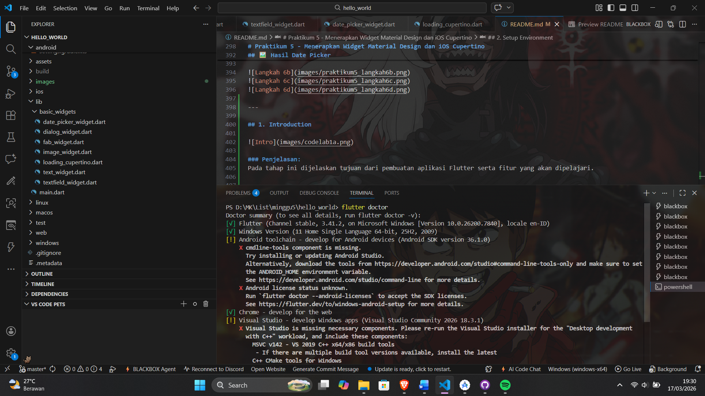 
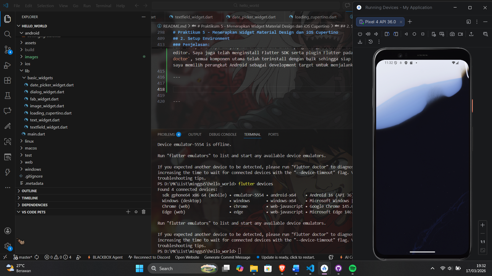

### Penjelasan:
Pada tahap ini saya menyiapkan environment untuk pengembangan Flutter dengan menggunakan Visual Studio Code sebagai code editor. Saya juga telah menginstall Flutter SDK serta plugin Flutter pada VS Code. Berdasarkan hasil perintah `flutter doctor`, semua komponen utama telah terinstall dengan baik sehingga siap digunakan untuk pengembangan aplikasi. Selain itu, saya memilih perangkat Android sebagai development target untuk menjalankan aplikasi.

---

## 3. Create a Project

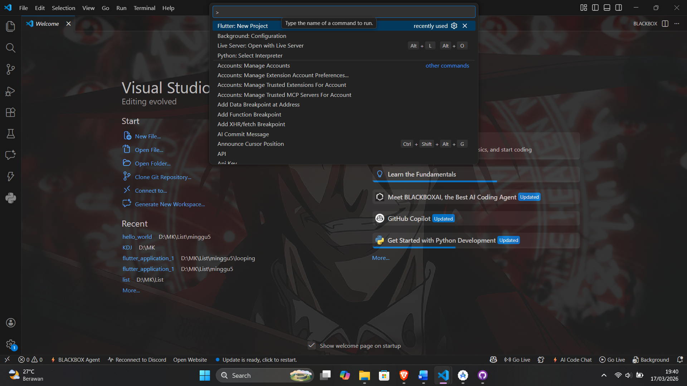
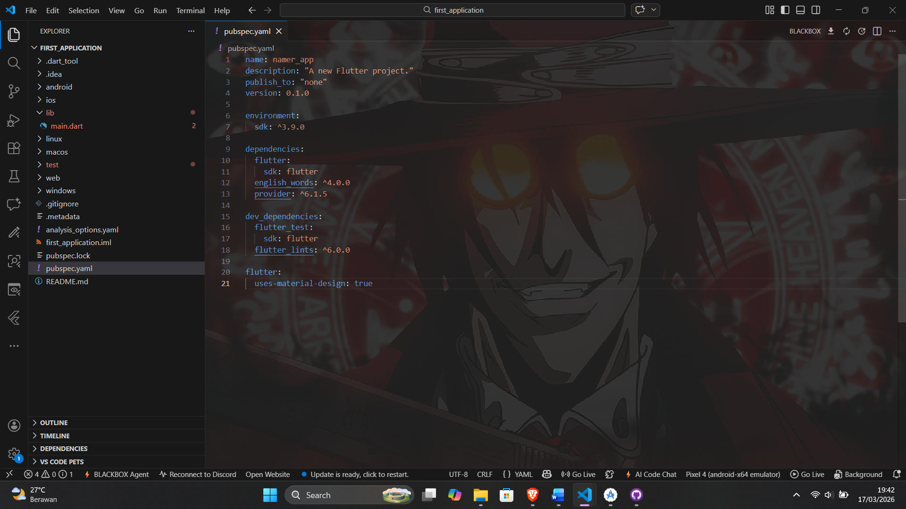
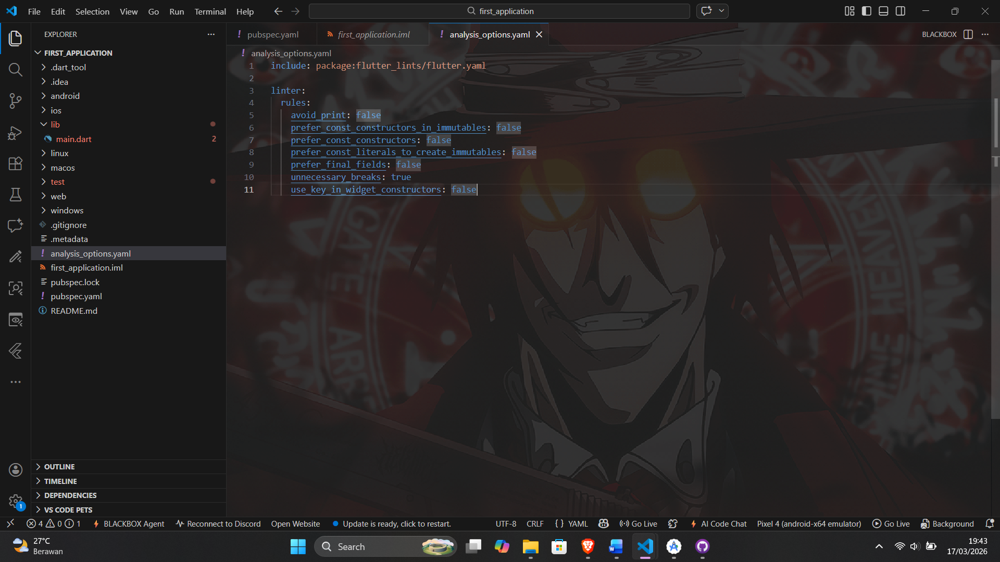
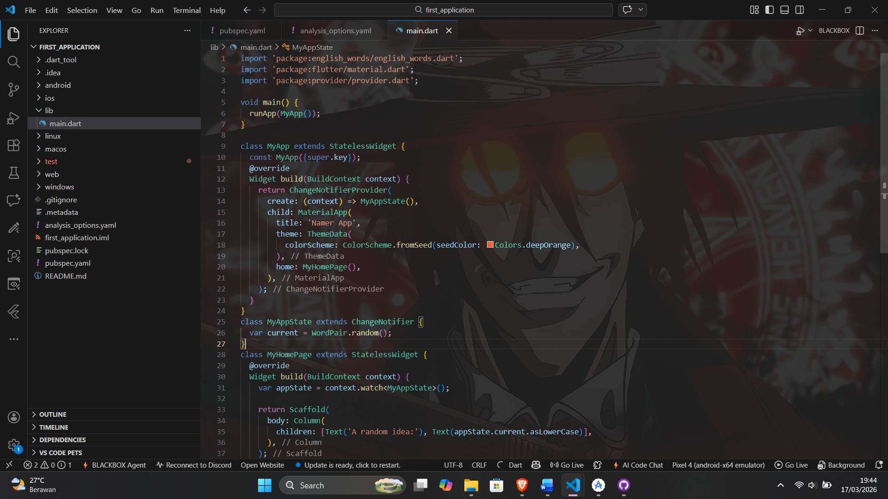

### Penjelasan:
Pada tahap ini saya membuat project Flutter baru menggunakan perintah "Flutter: New Project" di Visual Studio Code.
Setelah project berhasil dibuat, saya melakukan konfigurasi dengan mengubah beberapa file penting seperti:
- pubspec.yaml (untuk dependency)
- analysis_options.yaml (untuk aturan coding)
- main.dart (sebagai program utama)
Perubahan utama dilakukan pada file main.dart untuk menampilkan aplikasi sederhana dengan fitur generate kata secara acak.
Project berhasil dibuat dan siap untuk dijalankan pada tahap berikutnya.

---

## 4. Add a Button

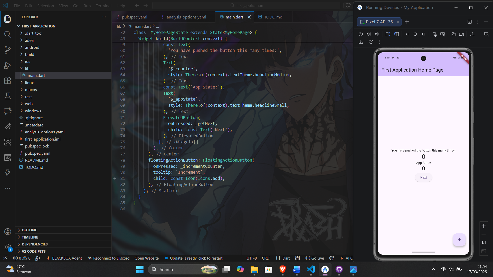
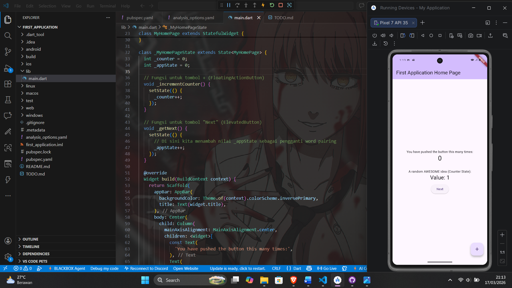

### Penjelasan:
Pada tahap ini saya menjalankan aplikasi Flutter menggunakan fitur debug pada VS Code. Kemudian saya mencoba fitur Hot Reload dengan mengubah teks pada aplikasi, dan perubahan langsung terlihat tanpa restart aplikasi. Selanjutnya saya menambahkan tombol "Next" menggunakan widget ElevatedButton. Tombol ini digunakan untuk menghasilkan kata baru setiap kali ditekan. Setelah menambahkan fungsi getNext(), tombol berhasil bekerja dengan menampilkan kata acak yang berbeda setiap kali ditekan.

---

## 5. Make the App Prettier

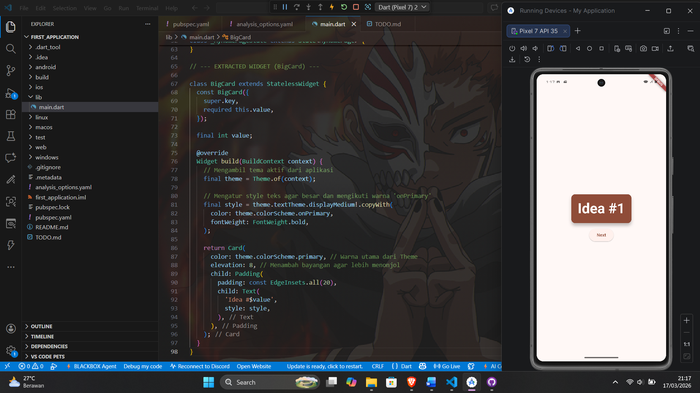

### Penjelasan:
Pada tahap ini dilakukan peningkatan tampilan (UI) aplikasi agar lebih menarik dan mudah dibaca oleh pengguna.

Perbaikan yang dilakukan antara lain:

1. **Extract Widget (BigCard)**  
   Teks yang menampilkan kata acak dipisahkan ke dalam widget baru bernama `BigCard` agar struktur kode lebih rapi dan mudah dikelola.

2. **Menambahkan Card dan Padding**  
   Widget `Text` dibungkus dengan `Padding` dan `Card` sehingga tampilan menjadi lebih jelas dan memiliki jarak (spacing) yang baik.

3. **Menggunakan Theme**  
   Warna pada Card diubah menggunakan `Theme` agar konsisten dengan desain aplikasi secara keseluruhan.

4. **Mengatur Text Style**  
   Ukuran dan warna teks diperbesar menggunakan `TextTheme` agar lebih mudah dibaca.

5. **Meningkatkan Aksesibilitas**  
   Menambahkan `semanticsLabel` agar teks dapat dibaca dengan baik oleh screen reader.

6. **Menempatkan UI di Tengah**  
   Menggunakan `Center` dan `mainAxisAlignment.center` agar tampilan aplikasi berada di tengah layar.

7. **Menambahkan Spasi (SizedBox)**  
   Memberikan jarak antar widget agar tampilan lebih rapi.
Hasilnya, aplikasi menjadi lebih menarik, terstruktur, dan nyaman digunakan.

---

## 6. Add Functionality (Like / Favorite)


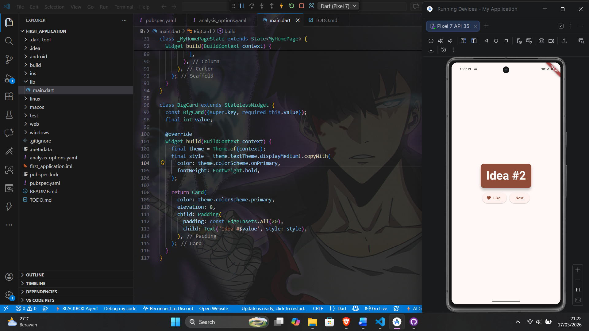


### Penjelasan:
Pada tahap ini dilakukan penambahan fitur interaksi berupa tombol **Like (Favorite)** agar pengguna dapat menyimpan kata yang disukai.

Perubahan yang dilakukan meliputi:

1. **Menambahkan List Favorites**  
   Menambahkan variabel `favorites` pada class `MyAppState` untuk menyimpan daftar kata yang disukai oleh pengguna.

2. **Menambahkan Function toggleFavorite()**  
   Function ini digunakan untuk:
   - Menambahkan kata ke daftar favorit jika belum ada
   - Menghapus kata jika sudah ada (toggle)
   - Memanggil `notifyListeners()` agar UI ter-update

3. **Menambahkan Button Like**  
   Menggunakan `ElevatedButton.icon()` untuk membuat tombol Like dengan ikon hati.

4. **Menggunakan Conditional Icon**  
   Ikon akan berubah:
   - ❤️ (favorite) jika sudah disukai  
   - 🤍 (border) jika belum  

5. **Menggunakan Row Layout**  
   Tombol Like dan Next diletakkan sejajar menggunakan widget `Row`.

6. **Menambahkan Spasi (SizedBox)**  
   Memberikan jarak antar tombol agar tampilan lebih rapi.

Hasilnya, aplikasi kini memiliki fitur untuk menyimpan kata favorit dan memberikan pengalaman interaktif kepada pengguna.

---

## 7. Add Navigation Rail

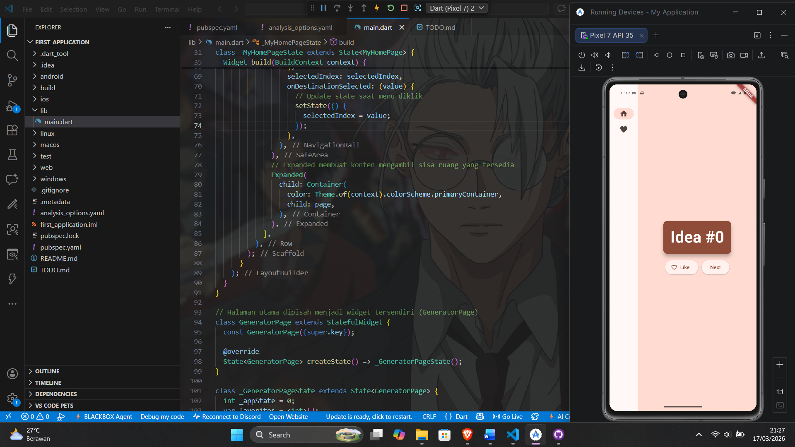
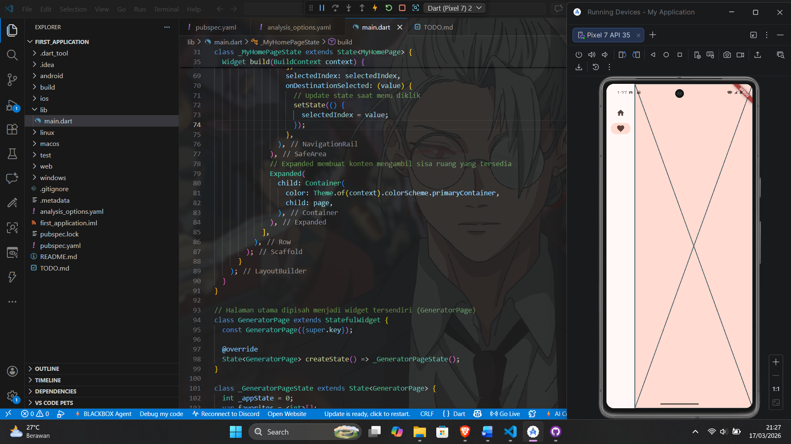

### Penjelasan:
Pada tahap ini dilakukan penambahan navigasi menggunakan **NavigationRail** untuk memisahkan halaman aplikasi menjadi beberapa bagian, yaitu halaman Home dan Favorites.

Perubahan yang dilakukan meliputi:

1. **Memisahkan Halaman (GeneratorPage)**  
   Konten utama aplikasi dipindahkan ke widget baru bernama `GeneratorPage` agar struktur aplikasi lebih modular.

2. **Menambahkan NavigationRail**  
   Digunakan sebagai menu navigasi di sisi kiri aplikasi dengan dua menu:
   - Home
   - Favorites

3. **Menggunakan StatefulWidget**  
   Widget `MyHomePage` diubah menjadi StatefulWidget agar dapat menyimpan state `selectedIndex` untuk menentukan halaman yang aktif.

4. **Menggunakan setState()**  
   Saat user memilih menu, nilai `selectedIndex` diperbarui menggunakan `setState()` sehingga tampilan ikut berubah.

5. **Menggunakan Switch Case untuk Navigasi**  
   Digunakan untuk menentukan halaman yang ditampilkan berdasarkan `selectedIndex`.

6. **Menggunakan LayoutBuilder (Responsif)**  
   NavigationRail dibuat responsif dengan menampilkan label jika lebar layar ≥ 600 pixel.

7. **Menggunakan Expanded Widget**  
   Digunakan agar halaman utama (kanan) mengisi sisa ruang yang tersedia.

Hasilnya, aplikasi kini memiliki navigasi antar halaman dan struktur yang lebih terorganisir serta responsif terhadap ukuran layar.

---

## 8. Add a New Page (Favorites Page)

.png)
.png)
.png)
.png)
.png)
.png)
.png)
.png)
.png)
.png)
.png)
.png)


### Penjelasan:
Pada tahap ini ditambahkan halaman baru bernama **FavoritesPage** yang berfungsi untuk menampilkan daftar kata yang telah disukai oleh pengguna.

Perubahan yang dilakukan meliputi:

1. **Membuat Widget FavoritesPage**  
   Dibuat widget baru bertipe StatelessWidget untuk menampilkan daftar favorit.

2. **Mengambil Data dari State**  
   Data favorit diambil menggunakan `context.watch<MyAppState>()`.

3. **Menampilkan Kondisi Kosong**  
   Jika belum ada data favorit, maka akan ditampilkan pesan:
   *"No favorites yet."*

4. **Menggunakan ListView**  
   Untuk menampilkan daftar favorit digunakan widget `ListView` agar dapat discroll.

5. **Menggunakan ListTile**  
   Setiap item favorit ditampilkan menggunakan `ListTile` dengan ikon ❤️ dan teks kata.

6. **Menampilkan Jumlah Favorit**  
   Ditambahkan informasi jumlah data favorit yang tersimpan.

7. **Menghubungkan ke Navigation**  
   Widget `Placeholder` pada NavigationRail diganti dengan `FavoritesPage`.

Hasilnya, aplikasi kini memiliki halaman khusus untuk menampilkan daftar kata favorit yang dipilih oleh pengguna.

---